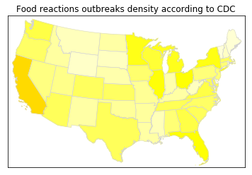

```python
import pandas as pd
import numpy as np

import matplotlib.pyplot as plt
import seaborn as sns

from mpl_toolkits.basemap import Basemap as Basemap
from matplotlib.colors import rgb2hex
from matplotlib.patches import Polygon
```


```python
#Upload full NORS 2013-2016
nors_in=pd.read_excel('NORS.xlsx')
nors=nors_in[['Year','State','Illnesses']]
#Pivoting
nors_piv=nors.pivot_table(
    values='Illnesses', index='State', columns='Year',
    fill_value=0, aggfunc='sum')
#nors_piv
nors_piv=nors_piv.rename_axis(None)
#nors_piv.columns=['State','2013','2014','2015','2016']
states=['Alabama', 'Alaska', 'Arizona', 'Arkansas', 'California', 'Colorado',
       'Connecticut', 'Delaware', 'Florida', 'Georgia', 'Hawaii', 'Idaho',
       'Illinois', 'Indiana', 'Iowa', 'Kansas', 'Kentucky', 'Louisiana',
       'Maine', 'Maryland', 'Massachusetts', 'Michigan', 'Minnesota',
       'Mississippi', 'Missouri', 'Montana', 'Multistate', 'Nebraska',
       'Nevada', 'New Hampshire', 'New Jersey', 'New Mexico', 'New York',
       'North Carolina', 'North Dakota', 'Ohio', 'Oklahoma', 'Oregon',
       'Pennsylvania', 'Puerto Rico', 'Rhode Island', 'South Carolina',
       'South Dakota', 'Tennessee', 'Texas', 'Utah', 'Vermont', 'Virginia',
       'Washington', 'Washington DC', 'West Virginia', 'Wisconsin', 'Wyoming']
#Overall NORS data for 2013-16
nors_2016={}
for i in range(0,len(states)):
    nors_2016[states[i]]= (nors_piv.loc[states[i]][2013]+
                             nors_piv.loc[states[i]][2014]+
                             nors_piv.loc[states[i]][2015]+
                             nors_piv.loc[states[i]][2016])
#nors_2016
```


    {'Alabama': 888,
     'Alaska': 215,
     'Arizona': 1253,
     'Arkansas': 456,
     'California': 4329,
     'Colorado': 1175,
     'Connecticut': 865,
     'Delaware': 51,
     'Florida': 2817,
     'Georgia': 1549,
     'Hawaii': 655,
     'Idaho': 425,
     'Illinois': 2785,
     'Indiana': 305,
     'Iowa': 956,
     'Kansas': 1114,
     'Kentucky': 393,
     'Louisiana': 374,
     'Maine': 97,
     'Maryland': 1331,
     'Massachusetts': 1139,
     'Michigan': 2385,
     'Minnesota': 2433,
     'Mississippi': 228,
     'Missouri': 528,
     'Montana': 210,
     'Multistate': 5205,
     'Nebraska': 319,
     'Nevada': 722,
     'New Hampshire': 165,
     'New Jersey': 848,
     'New Mexico': 373,
     'New York': 2488,
     'North Carolina': 1097,
     'North Dakota': 378,
     'Ohio': 2842,
     'Oklahoma': 466,
     'Oregon': 1085,
     'Pennsylvania': 826,
     'Puerto Rico': 323,
     'Rhode Island': 222,
     'South Carolina': 1246,
     'South Dakota': 198,
     'Tennessee': 1296,
     'Texas': 1263,
     'Utah': 633,
     'Vermont': 69,
     'Virginia': 1542,
     'Washington': 1550,
     'Washington DC': 215,
     'West Virginia': 194,
     'Wisconsin': 1795,
     'Wyoming': 143}


```python
m = Basemap(llcrnrlon=-119,llcrnrlat=22,urcrnrlon=-64,urcrnrlat=49,
        projection='lcc',lat_1=33,lat_2=45,lon_0=-95)
shp_info = m.readshapefile('st99_d00','states',drawbounds=True,color='lightgrey')

colors={}
statenames=[]
cmap = plt.cm.hot 
vmin = 0; vmax = 450 # set range.
for shapedict in m.states_info:
#    print(m.states_info)
    statename = shapedict['NAME']
    if statename not in ['District of Columbia','Puerto Rico','American Samoa',
                         'Guam','Commonwealth of the Northern Mariana Islands',
                        'United States Virgin Islands']:
#        print(statename)
#        print(pop)
        pop = nors_2016[statename]
        colors[statename] = cmap(1.-np.sqrt((pop-vmin)/(vmax-vmin))*0.1)[:3]
#        colors[statename]=(0,cmap(1.-np.sqrt((pop-vmin)/(vmax-vmin))),0)
    statenames.append(statename)
ax = plt.gca() # get current axes instance
for nshape,seg in enumerate(m.states):
    # skip DC and Puerto Rico.
    if statenames[nshape] not in ['District of Columbia','Puerto Rico','American Samoa',
                         'Guam','Commonwealth of the Northern Mariana Islands',
                        'United States Virgin Islands']:
        color = rgb2hex(colors[statenames[nshape]]) 
        poly = Polygon(seg,facecolor=color,edgecolor=color)
        ax.add_patch(poly)
        
plt.title('Food reactions outbreaks density according to CDC')
plt.savefig('NORS_map.png')
plt.show()

```




