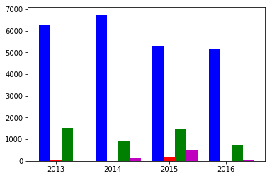

```
import pandas as pd
import numpy as np

import matplotlib.pyplot as plt
from difflib import SequenceMatcher

import seaborn as sns
```


```
#Uploading the CDC data from NORS
xls=pd.read_excel('norsDataTool.xlsx')
#cleaning the data
xls=xls[['Year','Month','Primary Mode','Etiology','Setting','Illnesses','Hospitalizations','Deaths','Food Vehicle']]

```


```
#xls
```


<div>
<style>
    .dataframe thead tr:only-child th {
        text-align: right;
    }

    .dataframe thead th {
        text-align: left;
    }

    .dataframe tbody tr th {
        vertical-align: top;
    }
</style>
<table border="1" class="dataframe">
  <thead>
    <tr style="text-align: right;">
      <th></th>
      <th>Year</th>
      <th>Month</th>
      <th>Primary Mode</th>
      <th>Etiology</th>
      <th>Setting</th>
      <th>Illnesses</th>
      <th>Hospitalizations</th>
      <th>Deaths</th>
      <th>Food Vehicle</th>
    </tr>
  </thead>
  <tbody>
    <tr>
      <th>0</th>
      <td>2013</td>
      <td>1</td>
      <td>Food</td>
      <td>Norovirus Genogroup II</td>
      <td>Restaurant - Sit-down dining</td>
      <td>10</td>
      <td>0.0</td>
      <td>0.0</td>
      <td>NaN</td>
    </tr>
    <tr>
      <th>1</th>
      <td>2013</td>
      <td>1</td>
      <td>Food</td>
      <td>NaN</td>
      <td>Restaurant - Sit-down dining; Private home/res...</td>
      <td>22</td>
      <td>1.0</td>
      <td>0.0</td>
      <td>NaN</td>
    </tr>
    <tr>
      <th>2</th>
      <td>2013</td>
      <td>2</td>
      <td>Food</td>
      <td>NaN</td>
      <td>Caterer (food prepared off-site from where ser...</td>
      <td>30</td>
      <td>0.0</td>
      <td>0.0</td>
      <td>NaN</td>
    </tr>
    <tr>
      <th>3</th>
      <td>2013</td>
      <td>2</td>
      <td>Food</td>
      <td>NaN</td>
      <td>Banquet Facility (food prepared and served on-...</td>
      <td>9</td>
      <td>0.0</td>
      <td>0.0</td>
      <td>NaN</td>
    </tr>
    <tr>
      <th>4</th>
      <td>2013</td>
      <td>2</td>
      <td>Food</td>
      <td>Norovirus Genogroup II</td>
      <td>Long-term care/nursing home/assisted living fa...</td>
      <td>52</td>
      <td>0.0</td>
      <td>0.0</td>
      <td>NaN</td>
    </tr>
    <tr>
      <th>5</th>
      <td>2013</td>
      <td>2</td>
      <td>Food</td>
      <td>NaN</td>
      <td>Restaurant - "Fast-food"(drive up service or p...</td>
      <td>11</td>
      <td>0.0</td>
      <td>0.0</td>
      <td>NaN</td>
    </tr>
    <tr>
      <th>6</th>
      <td>2013</td>
      <td>2</td>
      <td>Food</td>
      <td>NaN</td>
      <td>Restaurant - Sit-down dining</td>
      <td>25</td>
      <td>0.0</td>
      <td>0.0</td>
      <td>NaN</td>
    </tr>
    <tr>
      <th>7</th>
      <td>2013</td>
      <td>2</td>
      <td>Food</td>
      <td>NaN</td>
      <td>Restaurant - Sit-down dining</td>
      <td>8</td>
      <td>1.0</td>
      <td>0.0</td>
      <td>NaN</td>
    </tr>
    <tr>
      <th>8</th>
      <td>2013</td>
      <td>2</td>
      <td>Food</td>
      <td>NaN</td>
      <td>Caterer (food prepared off-site from where ser...</td>
      <td>12</td>
      <td>0.0</td>
      <td>0.0</td>
      <td>NaN</td>
    </tr>
    <tr>
      <th>9</th>
      <td>2013</td>
      <td>2</td>
      <td>Food</td>
      <td>Trichinella spiralis</td>
      <td>Private home/residence</td>
      <td>9</td>
      <td>1.0</td>
      <td>0.0</td>
      <td>boar meat</td>
    </tr>
    <tr>
      <th>10</th>
      <td>2013</td>
      <td>4</td>
      <td>Food</td>
      <td>Rotavirus</td>
      <td>Banquet Facility (food prepared and served on-...</td>
      <td>58</td>
      <td>0.0</td>
      <td>0.0</td>
      <td>NaN</td>
    </tr>
    <tr>
      <th>11</th>
      <td>2013</td>
      <td>4</td>
      <td>Food</td>
      <td>Norovirus Genogroup II; Norovirus Genogroup II</td>
      <td>Banquet Facility (food prepared and served on-...</td>
      <td>57</td>
      <td>1.0</td>
      <td>0.0</td>
      <td>french dressing; butter; iced tea</td>
    </tr>
    <tr>
      <th>12</th>
      <td>2013</td>
      <td>5</td>
      <td>Food</td>
      <td>NaN</td>
      <td>Restaurant - Sit-down dining</td>
      <td>8</td>
      <td>0.0</td>
      <td>0.0</td>
      <td>NaN</td>
    </tr>
    <tr>
      <th>13</th>
      <td>2013</td>
      <td>5</td>
      <td>Food</td>
      <td>NaN</td>
      <td>Restaurant - Sit-down dining</td>
      <td>6</td>
      <td>0.0</td>
      <td>0.0</td>
      <td>NaN</td>
    </tr>
    <tr>
      <th>14</th>
      <td>2013</td>
      <td>5</td>
      <td>Food</td>
      <td>NaN</td>
      <td>Restaurant - Sit-down dining</td>
      <td>13</td>
      <td>0.0</td>
      <td>0.0</td>
      <td>NaN</td>
    </tr>
    <tr>
      <th>15</th>
      <td>2013</td>
      <td>5</td>
      <td>Food</td>
      <td>NaN</td>
      <td>Restaurant - Sit-down dining</td>
      <td>6</td>
      <td>0.0</td>
      <td>0.0</td>
      <td>NaN</td>
    </tr>
    <tr>
      <th>16</th>
      <td>2013</td>
      <td>5</td>
      <td>Food</td>
      <td>Salmonella enterica</td>
      <td>Grocery store</td>
      <td>8</td>
      <td>3.0</td>
      <td>0.0</td>
      <td>NaN</td>
    </tr>
    <tr>
      <th>17</th>
      <td>2013</td>
      <td>6</td>
      <td>Food</td>
      <td>Norovirus Genogroup II</td>
      <td>Restaurant - Sit-down dining</td>
      <td>9</td>
      <td>0.0</td>
      <td>0.0</td>
      <td>NaN</td>
    </tr>
    <tr>
      <th>18</th>
      <td>2013</td>
      <td>1</td>
      <td>Food</td>
      <td>Salmonella enterica</td>
      <td>Private home/residence</td>
      <td>84</td>
      <td>17.0</td>
      <td>0.0</td>
      <td>cucumber</td>
    </tr>
    <tr>
      <th>19</th>
      <td>2013</td>
      <td>6</td>
      <td>Food</td>
      <td>Norovirus Genogroup I</td>
      <td>Caterer (food prepared off-site from where ser...</td>
      <td>117</td>
      <td>1.0</td>
      <td>0.0</td>
      <td>hamburger; fruit salad</td>
    </tr>
    <tr>
      <th>20</th>
      <td>2013</td>
      <td>5</td>
      <td>Food</td>
      <td>Escherichia coli, Shiga toxin-producing</td>
      <td>Restaurant - Sit-down dining</td>
      <td>51</td>
      <td>10.0</td>
      <td>0.0</td>
      <td>NaN</td>
    </tr>
    <tr>
      <th>21</th>
      <td>2013</td>
      <td>4</td>
      <td>Food</td>
      <td>Salmonella enterica</td>
      <td>Restaurant - Sit-down dining</td>
      <td>9</td>
      <td>3.0</td>
      <td>0.0</td>
      <td>NaN</td>
    </tr>
    <tr>
      <th>22</th>
      <td>2013</td>
      <td>2</td>
      <td>Indeterminate/Other/Unknown</td>
      <td>Salmonella enterica</td>
      <td>NaN</td>
      <td>2</td>
      <td>2.0</td>
      <td>1.0</td>
      <td>NaN</td>
    </tr>
    <tr>
      <th>23</th>
      <td>2013</td>
      <td>6</td>
      <td>Food</td>
      <td>NaN</td>
      <td>Restaurant - Sit-down dining</td>
      <td>13</td>
      <td>0.0</td>
      <td>0.0</td>
      <td>NaN</td>
    </tr>
    <tr>
      <th>24</th>
      <td>2013</td>
      <td>4</td>
      <td>Food</td>
      <td>Escherichia coli, Shiga toxin-producing</td>
      <td>Private home/residence</td>
      <td>14</td>
      <td>9.0</td>
      <td>1.0</td>
      <td>prepackaged leafy greens</td>
    </tr>
    <tr>
      <th>25</th>
      <td>2013</td>
      <td>7</td>
      <td>Water</td>
      <td>Cryptosporidium unknown</td>
      <td>Community/Municipality</td>
      <td>3</td>
      <td>0.0</td>
      <td>0.0</td>
      <td>NaN</td>
    </tr>
    <tr>
      <th>26</th>
      <td>2013</td>
      <td>7</td>
      <td>Food</td>
      <td>Vibrio parahaemolyticus</td>
      <td>Restaurant - other or unknown type</td>
      <td>2</td>
      <td>1.0</td>
      <td>0.0</td>
      <td>oysters</td>
    </tr>
    <tr>
      <th>27</th>
      <td>2013</td>
      <td>8</td>
      <td>Food</td>
      <td>NaN</td>
      <td>Restaurant - "Fast-food"(drive up service or p...</td>
      <td>6</td>
      <td>0.0</td>
      <td>0.0</td>
      <td>NaN</td>
    </tr>
    <tr>
      <th>28</th>
      <td>2013</td>
      <td>3</td>
      <td>Food</td>
      <td>NaN</td>
      <td>Caterer (food prepared off-site from where ser...</td>
      <td>21</td>
      <td>0.0</td>
      <td>0.0</td>
      <td>NaN</td>
    </tr>
    <tr>
      <th>29</th>
      <td>2013</td>
      <td>8</td>
      <td>Food</td>
      <td>NaN</td>
      <td>Caterer (food prepared off-site from where ser...</td>
      <td>8</td>
      <td>0.0</td>
      <td>0.0</td>
      <td>NaN</td>
    </tr>
    <tr>
      <th>...</th>
      <td>...</td>
      <td>...</td>
      <td>...</td>
      <td>...</td>
      <td>...</td>
      <td>...</td>
      <td>...</td>
      <td>...</td>
      <td>...</td>
    </tr>
    <tr>
      <th>1031</th>
      <td>2016</td>
      <td>10</td>
      <td>Person-to-person</td>
      <td>Norovirus Genogroup II</td>
      <td>Shelter/group home/transitional housing</td>
      <td>9</td>
      <td>0.0</td>
      <td>0.0</td>
      <td>NaN</td>
    </tr>
    <tr>
      <th>1032</th>
      <td>2016</td>
      <td>12</td>
      <td>Person-to-person</td>
      <td>Norovirus Genogroup II</td>
      <td>Long-term care/nursing home/assisted living fa...</td>
      <td>45</td>
      <td>0.0</td>
      <td>0.0</td>
      <td>NaN</td>
    </tr>
    <tr>
      <th>1033</th>
      <td>2016</td>
      <td>12</td>
      <td>Person-to-person</td>
      <td>Norovirus Genogroup II</td>
      <td>Long-term care/nursing home/assisted living fa...</td>
      <td>27</td>
      <td>13.0</td>
      <td>0.0</td>
      <td>NaN</td>
    </tr>
    <tr>
      <th>1034</th>
      <td>2016</td>
      <td>12</td>
      <td>Person-to-person</td>
      <td>Norovirus Genogroup II</td>
      <td>Long-term care/nursing home/assisted living fa...</td>
      <td>28</td>
      <td>0.0</td>
      <td>0.0</td>
      <td>NaN</td>
    </tr>
    <tr>
      <th>1035</th>
      <td>2016</td>
      <td>12</td>
      <td>Person-to-person</td>
      <td>Norovirus Genogroup II</td>
      <td>Long-term care/nursing home/assisted living fa...</td>
      <td>74</td>
      <td>1.0</td>
      <td>0.0</td>
      <td>NaN</td>
    </tr>
    <tr>
      <th>1036</th>
      <td>2016</td>
      <td>11</td>
      <td>Person-to-person</td>
      <td>Norovirus Genogroup II</td>
      <td>Long-term care/nursing home/assisted living fa...</td>
      <td>64</td>
      <td>0.0</td>
      <td>2.0</td>
      <td>NaN</td>
    </tr>
    <tr>
      <th>1037</th>
      <td>2016</td>
      <td>11</td>
      <td>Person-to-person</td>
      <td>Norovirus Genogroup II</td>
      <td>Long-term care/nursing home/assisted living fa...</td>
      <td>69</td>
      <td>0.0</td>
      <td>0.0</td>
      <td>NaN</td>
    </tr>
    <tr>
      <th>1038</th>
      <td>2016</td>
      <td>3</td>
      <td>Person-to-person</td>
      <td>Norovirus Genogroup II</td>
      <td>Office/indoor workplace</td>
      <td>4</td>
      <td>0.0</td>
      <td>0.0</td>
      <td>NaN</td>
    </tr>
    <tr>
      <th>1039</th>
      <td>2016</td>
      <td>5</td>
      <td>Person-to-person</td>
      <td>Shigella sonnei</td>
      <td>School/college/university</td>
      <td>4</td>
      <td>2.0</td>
      <td>0.0</td>
      <td>NaN</td>
    </tr>
    <tr>
      <th>1040</th>
      <td>2016</td>
      <td>10</td>
      <td>Food</td>
      <td>Other - Chemical/Toxin</td>
      <td>Caterer (food prepared off-site from where ser...</td>
      <td>9</td>
      <td>0.0</td>
      <td>0.0</td>
      <td>NaN</td>
    </tr>
    <tr>
      <th>1041</th>
      <td>2016</td>
      <td>12</td>
      <td>Food</td>
      <td>Other</td>
      <td>Other</td>
      <td>12</td>
      <td>0.0</td>
      <td>0.0</td>
      <td>gummy bears</td>
    </tr>
    <tr>
      <th>1042</th>
      <td>2016</td>
      <td>12</td>
      <td>Food</td>
      <td>Norovirus Genogroup II</td>
      <td>Restaurant - Sit-down dining</td>
      <td>21</td>
      <td>0.0</td>
      <td>0.0</td>
      <td>NaN</td>
    </tr>
    <tr>
      <th>1043</th>
      <td>2016</td>
      <td>12</td>
      <td>Person-to-person</td>
      <td>Norovirus unknown</td>
      <td>Other, specify</td>
      <td>37</td>
      <td>1.0</td>
      <td>0.0</td>
      <td>NaN</td>
    </tr>
    <tr>
      <th>1044</th>
      <td>2016</td>
      <td>12</td>
      <td>Person-to-person</td>
      <td>Norovirus unknown</td>
      <td>Other, specify</td>
      <td>5</td>
      <td>0.0</td>
      <td>NaN</td>
      <td>NaN</td>
    </tr>
    <tr>
      <th>1045</th>
      <td>2016</td>
      <td>12</td>
      <td>Person-to-person</td>
      <td>Norovirus unknown</td>
      <td>Hospital</td>
      <td>23</td>
      <td>0.0</td>
      <td>0.0</td>
      <td>NaN</td>
    </tr>
    <tr>
      <th>1046</th>
      <td>2016</td>
      <td>12</td>
      <td>Person-to-person</td>
      <td>Norovirus unknown</td>
      <td>Other, specify</td>
      <td>48</td>
      <td>1.0</td>
      <td>0.0</td>
      <td>NaN</td>
    </tr>
    <tr>
      <th>1047</th>
      <td>2016</td>
      <td>8</td>
      <td>Food</td>
      <td>Norovirus</td>
      <td>Restaurant - Sit-down dining</td>
      <td>13</td>
      <td>0.0</td>
      <td>0.0</td>
      <td>gyro</td>
    </tr>
    <tr>
      <th>1048</th>
      <td>2016</td>
      <td>4</td>
      <td>Food</td>
      <td>Salmonella enterica</td>
      <td>Unknown</td>
      <td>14</td>
      <td>5.0</td>
      <td>0.0</td>
      <td>NaN</td>
    </tr>
    <tr>
      <th>1049</th>
      <td>2016</td>
      <td>8</td>
      <td>Food</td>
      <td>NaN</td>
      <td>Caterer (food prepared off-site from where ser...</td>
      <td>3</td>
      <td>0.0</td>
      <td>0.0</td>
      <td>NaN</td>
    </tr>
    <tr>
      <th>1050</th>
      <td>2015</td>
      <td>3</td>
      <td>Animal Contact</td>
      <td>Salmonella enterica</td>
      <td>NaN</td>
      <td>79</td>
      <td>25.0</td>
      <td>0.0</td>
      <td>NaN</td>
    </tr>
    <tr>
      <th>1051</th>
      <td>2016</td>
      <td>7</td>
      <td>Food</td>
      <td>Salmonella enterica</td>
      <td>Private home/residence; Grocery store</td>
      <td>64</td>
      <td>16.0</td>
      <td>0.0</td>
      <td>chicken</td>
    </tr>
    <tr>
      <th>1052</th>
      <td>2016</td>
      <td>11</td>
      <td>Food</td>
      <td>Bacillus cereus</td>
      <td>Restaurant - Sit-down dining</td>
      <td>3</td>
      <td>0.0</td>
      <td>0.0</td>
      <td>NaN</td>
    </tr>
    <tr>
      <th>1053</th>
      <td>2016</td>
      <td>10</td>
      <td>Food</td>
      <td>Salmonella enterica</td>
      <td>Private home/residence</td>
      <td>7</td>
      <td>3.0</td>
      <td>0.0</td>
      <td>NaN</td>
    </tr>
    <tr>
      <th>1054</th>
      <td>2016</td>
      <td>10</td>
      <td>Food</td>
      <td>Salmonella enterica</td>
      <td>Fair, festival, other temp or mobile services</td>
      <td>62</td>
      <td>3.0</td>
      <td>0.0</td>
      <td>NaN</td>
    </tr>
    <tr>
      <th>1055</th>
      <td>2016</td>
      <td>10</td>
      <td>Food</td>
      <td>Salmonella</td>
      <td>Other</td>
      <td>2</td>
      <td>0.0</td>
      <td>0.0</td>
      <td>unspecified ready-to-eat hot meal</td>
    </tr>
    <tr>
      <th>1056</th>
      <td>2016</td>
      <td>9</td>
      <td>Food</td>
      <td>Escherichia coli, Shiga toxin-producing</td>
      <td>Unknown</td>
      <td>20</td>
      <td>7.0</td>
      <td>2.0</td>
      <td>NaN</td>
    </tr>
    <tr>
      <th>1057</th>
      <td>2015</td>
      <td>9</td>
      <td>Person-to-person</td>
      <td>Shigella sonnei</td>
      <td>Other, specify</td>
      <td>373</td>
      <td>27.0</td>
      <td>0.0</td>
      <td>NaN</td>
    </tr>
    <tr>
      <th>1058</th>
      <td>2016</td>
      <td>6</td>
      <td>Food</td>
      <td>Escherichia coli, Shiga toxin-producing</td>
      <td>NaN</td>
      <td>96</td>
      <td>19.0</td>
      <td>0.0</td>
      <td>cilantro</td>
    </tr>
    <tr>
      <th>1059</th>
      <td>2016</td>
      <td>4</td>
      <td>Food</td>
      <td>Salmonella enterica</td>
      <td>Restaurant - Sit-down dining</td>
      <td>8</td>
      <td>2.0</td>
      <td>0.0</td>
      <td>shell eggs</td>
    </tr>
    <tr>
      <th>1060</th>
      <td>2016</td>
      <td>8</td>
      <td>Food</td>
      <td>Salmonella enterica</td>
      <td>NaN</td>
      <td>53</td>
      <td>9.0</td>
      <td>1.0</td>
      <td>NaN</td>
    </tr>
  </tbody>
</table>
<p>1061 rows × 9 columns</p>
</div>


```
#Etiology stats
xls_etim=xls[pd.notnull(xls['Etiology'])]
xls_etim=xls_etim[['Year','Etiology','Illnesses']]

ill_list=['Bacillus cereus','Campylobacter','Clostridium','Cryptosporidium','Escherichia coli',
         'Giardia unknown','Hepatitis A','Legionella pneumophila','Listeria monocytogenes',
         'Norovirus','Other','Pseudomonas','Rotavirus','Salmonella','Sapovirus','Shigella',
         'Staphylococcus','Trichinella spiralis','Vibrio parahaemolyticus']

for k,row in xls_etim.iterrows():
    if row[1] not in ill_list:
        for i in range(0,len(ill_list)):
            s1=ill_list[i]
            s2=row[1]
            if (SequenceMatcher(a=s1,b=s2[:len(s1)]).ratio()>0.8):
                xls_etim.loc[k,'Etiology']=s1
                break
            
xls_etim['Etiology'].value_counts()
display_list=['Norovirus','Salmonella','Shigella','Rotavirus']

xls_display=xls_etim[xls_etim['Etiology'].isin(display_list)]

xls_display_piv=xls_display.pivot_table(
    values='Illnesses', index='Etiology', columns='Year',
    fill_value=0, aggfunc='sum')
type(xls_display_piv.iloc[0])

x_axis1=[2012.8,2013.8,2014.8,2015.8]
x_axis2=[2013.0,2014.0,2015.0,2016.0]
x_axis3=[2013.2,2014.2,2015.2,2016.2]
x_axis4=[2013.4,2014.4,2015.4,2016.4]
tick_locations = [value for value in x_axis]
plt.xticks(tick_locations, ["2013", "2014", "2015", "2016"])

y1=xls_display_piv.iloc[0]
y2=xls_display_piv.iloc[1]
y3=xls_display_piv.iloc[2]
y4=xls_display_piv.iloc[3]

ax = plt.subplot(111)
ax.bar(x_axis1, y1,width=0.2,color='b',align='center')
ax.bar(x_axis2, y2,width=0.2,color='r',align='center')
ax.bar(x_axis3, y3,width=0.2,color='g',align='center')
ax.bar(x_axis4, y4,width=0.2,color='m',align='center')

#plt.legend()
plt.show()
```

    /Users/osakharnykh/anaconda3/lib/python3.6/site-packages/matplotlib/cbook/deprecation.py:106: MatplotlibDeprecationWarning: Adding an axes using the same arguments as a previous axes currently reuses the earlier instance.  In a future version, a new instance will always be created and returned.  Meanwhile, this warning can be suppressed, and the future behavior ensured, by passing a unique label to each axes instance.
      warnings.warn(message, mplDeprecation, stacklevel=1)




