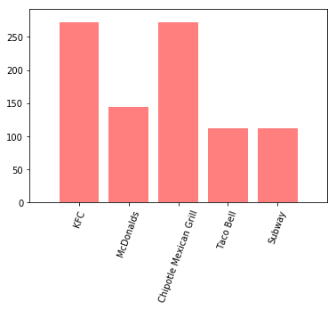

```python
import tweepy
import json
import numpy as np
import pandas as pd

# Import and Initialize Sentiment Analyzer
from vaderSentiment.vaderSentiment import SentimentIntensityAnalyzer
analyzer = SentimentIntensityAnalyzer()

import matplotlib.pyplot as plt
```


```python
from config import consumer_key, consumer_secret, access_token, access_token_secret

auth = tweepy.OAuthHandler(consumer_key, consumer_secret)
auth.set_access_token(access_token, access_token_secret)
api = tweepy.API(auth, parser=tweepy.parsers.JSONParser())
```


```python
target="@iwaspoisoned_"
date_list=[]
tweet_list=[]

tweet_array = []
oldest_tweet = ""

for x in range(16):
    public_tweets = api.user_timeline(target,count=200)
#    print(len(public_tweets))
    for tweet in public_tweets:

        date_list.append(tweet['created_at'])
        tweet_array.append(tweet['text'])

        oldest_tweet = tweet["id_str"]

# Print total number of tweets
print(len(tweet_array))


```

    3200


```python
#tweet_array

df=pd.DataFrame(columns=['Date','Text','Venue','Location','City','State'])
df['Date']=date_list
df['Text']=tweet_array
for i,row in df.iterrows():
    try:
        df.iloc[i,2]=df.iloc[i,1].split(' - ')[0]
        df.iloc[i,3]=df.iloc[i,1].split(' - ')[1]
        df.iloc[i,4]=df.iloc[i,3].split(',')[0]
        df.iloc[i,5]=df.iloc[i,3].split(',')[1]
    except:
        pass
df_filtered=df[['Venue','City','State']]

```


```python
#pass to csv
df_filtered.to_csv('offenders.csv')
```


```python
offenders=[]
offenders=df_filtered['Venue'].value_counts()[1:11]
offenders
```


    McDonalds                 272
    Chipotle Mexican Grill    272
    KFC                       144
    Taco Bell                 112
    Subway                    112
    Dunkin donuts              96
    Burger King                80
    Wendy's                    80
    Arby's                     64
    Panera Bread               64
    Name: Venue, dtype: int64


```python
# Target Search Term
target_terms = ('@ChipotleTweets','@McDonalds','@SUBWAY','@tacobell','@Wendys',
               '@dominos','@BurgerKing','@Costco','@PopeyesChicken','@PandaExpress')

# "Real Person" Filters
#min_tweets = 5
#max_tweets = 10000
#max_followers = 2500
#max_following = 2500
#lang = "en"

# Array to hold sentiment
#sentiment_array = []

# Variable for holding the oldest tweet
#oldest_tweet = ""

#for target_term in target_terms:
#    compound_list=[]
#    positive_list=[]
#    negative_list=[]
#    neutral_list=[]
    
#    public_tweets = api.search(target_term, count=4000)
    
#    for tweet in public_tweets['statuses']:
        
#        if (tweet["user"]["followers_count"] < max_followers and
#        tweet["user"]["statuses_count"] > min_tweets and
#        tweet["user"]["statuses_count"] < max_tweets and
#        tweet["user"]["friends_count"] < max_following and
#            tweet["user"]["lang"] == lang):
            
#            tweet_analysis = analyzer.polarity_scores(tweet['text'])
#            compound_list.append(tweet_analysis['compound'])
#            positive_list.append(tweet_analysis['pos'])
#            negative_list.append(tweet_analysis['neg'])
#            neutral_list.append(tweet_analysis['neu'])

#    print('The twitter about ',target_term)
#    print('Compound: ',np.mean(compound_list))
#    print('Positive: ',np.mean(positive_list))
#    print('Negative: ',np.mean(negative_list))
#    print('Neutral : ',np.mean(neutral_list))

```


```python
#Plotting
x_axis=[]
y_axis=[]
x_axis=offenders.index[0:5]
y_axis=offenders[0:5]

plt.bar(x_axis, y_axis, color='r', alpha=0.5, align="center")
tick_locations = [value for value in x_axis]
plt.xticks(tick_locations, rotation=70)

plt.xlim(-1, len(x_axis))
plt.ylim(0, max(y_axis)+20)

plt.show()
```




