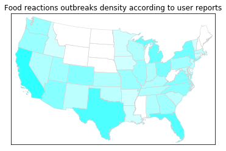

```python
import pandas as pd
import numpy as np

import matplotlib.pyplot as plt
import seaborn as sns

from mpl_toolkits.basemap import Basemap as Basemap
from matplotlib.colors import rgb2hex
from matplotlib.patches import Polygon
```


```python
reports_in=pd.read_csv('offenders.csv')
reports=reports_in[['City','State']]
reports['Count']=1

#Pivoting
reports_piv=reports.pivot_table(
    values='Count', index='State',
    fill_value=0, aggfunc='sum')
#reports_piv
#reports_piv=reports_piv.rename_axis(None)


states=['Alabama', 'Alaska', 'Arizona', 'Arkansas', 'California', 'Colorado',
       'Connecticut', 'Delaware', 'Florida', 'Georgia', 'Hawaii', 'Idaho',
       'Illinois', 'Indiana', 'Iowa', 'Kansas', 'Kentucky', 'Louisiana',
       'Maine', 'Maryland', 'Massachusetts', 'Michigan', 'Minnesota',
       'Mississippi', 'Missouri', 'Montana', 'Nebraska',
       'Nevada', 'New Hampshire', 'New Jersey', 'New Mexico', 'New York',
       'North Carolina', 'North Dakota', 'Ohio', 'Oklahoma', 'Oregon',
       'Pennsylvania', 'Puerto Rico', 'Rhode Island', 'South Carolina',
       'South Dakota', 'Tennessee', 'Texas', 'Utah', 'Vermont', 'Virginia',
       'Washington', 'Washington DC', 'West Virginia', 'Wisconsin', 'Wyoming']

#reports_piv = reports_piv.set_index('State')
reports_piv
```

    /Users/osakharnykh/anaconda3/lib/python3.6/site-packages/ipykernel_launcher.py:3: SettingWithCopyWarning: 
    A value is trying to be set on a copy of a slice from a DataFrame.
    Try using .loc[row_indexer,col_indexer] = value instead
    
    See the caveats in the documentation: http://pandas.pydata.org/pandas-docs/stable/indexing.html#indexing-view-versus-copy
      This is separate from the ipykernel package so we can avoid doing imports until


<div>
<style>
    .dataframe thead tr:only-child th {
        text-align: right;
    }

    .dataframe thead th {
        text-align: left;
    }

    .dataframe tbody tr th {
        vertical-align: top;
    }
</style>
<table border="1" class="dataframe">
  <thead>
    <tr style="text-align: right;">
      <th></th>
      <th>Count</th>
    </tr>
    <tr>
      <th>State</th>
      <th></th>
    </tr>
  </thead>
  <tbody>
    <tr>
      <th></th>
      <td>48</td>
    </tr>
    <tr>
      <th>Alabama</th>
      <td>48</td>
    </tr>
    <tr>
      <th>Alberta</th>
      <td>16</td>
    </tr>
    <tr>
      <th>Arizona</th>
      <td>112</td>
    </tr>
    <tr>
      <th>Arkansas</th>
      <td>16</td>
    </tr>
    <tr>
      <th>British Columbia</th>
      <td>16</td>
    </tr>
    <tr>
      <th>California</th>
      <td>320</td>
    </tr>
    <tr>
      <th>Colorado</th>
      <td>112</td>
    </tr>
    <tr>
      <th>Connecticut</th>
      <td>16</td>
    </tr>
    <tr>
      <th>County Limerick</th>
      <td>16</td>
    </tr>
    <tr>
      <th>England</th>
      <td>64</td>
    </tr>
    <tr>
      <th>Florida</th>
      <td>208</td>
    </tr>
    <tr>
      <th>GA</th>
      <td>16</td>
    </tr>
    <tr>
      <th>Georgia</th>
      <td>64</td>
    </tr>
    <tr>
      <th>Hawaii</th>
      <td>48</td>
    </tr>
    <tr>
      <th>Idaho</th>
      <td>16</td>
    </tr>
    <tr>
      <th>Illinois</th>
      <td>80</td>
    </tr>
    <tr>
      <th>Indiana</th>
      <td>48</td>
    </tr>
    <tr>
      <th>Iowa</th>
      <td>16</td>
    </tr>
    <tr>
      <th>Kansas</th>
      <td>48</td>
    </tr>
    <tr>
      <th>Kentucky</th>
      <td>48</td>
    </tr>
    <tr>
      <th>La Altagracia</th>
      <td>16</td>
    </tr>
    <tr>
      <th>Louisiana</th>
      <td>16</td>
    </tr>
    <tr>
      <th>Maryland</th>
      <td>32</td>
    </tr>
    <tr>
      <th>Massachusetts</th>
      <td>32</td>
    </tr>
    <tr>
      <th>Michigan</th>
      <td>160</td>
    </tr>
    <tr>
      <th>Minnesota</th>
      <td>16</td>
    </tr>
    <tr>
      <th>Missouri</th>
      <td>80</td>
    </tr>
    <tr>
      <th>Nevada</th>
      <td>48</td>
    </tr>
    <tr>
      <th>New Jersey</th>
      <td>32</td>
    </tr>
    <tr>
      <th>New Mexico</th>
      <td>32</td>
    </tr>
    <tr>
      <th>New South Wales</th>
      <td>16</td>
    </tr>
    <tr>
      <th>New York</th>
      <td>144</td>
    </tr>
    <tr>
      <th>North Carolina</th>
      <td>96</td>
    </tr>
    <tr>
      <th>Ohio</th>
      <td>128</td>
    </tr>
    <tr>
      <th>Oklahoma</th>
      <td>32</td>
    </tr>
    <tr>
      <th>Ontario</th>
      <td>112</td>
    </tr>
    <tr>
      <th>Oregon</th>
      <td>80</td>
    </tr>
    <tr>
      <th>Pennsylvania</th>
      <td>64</td>
    </tr>
    <tr>
      <th>Scotland</th>
      <td>16</td>
    </tr>
    <tr>
      <th>South Carolina</th>
      <td>32</td>
    </tr>
    <tr>
      <th>TN</th>
      <td>16</td>
    </tr>
    <tr>
      <th>Tennessee</th>
      <td>48</td>
    </tr>
    <tr>
      <th>Texas</th>
      <td>224</td>
    </tr>
    <tr>
      <th>Utah</th>
      <td>64</td>
    </tr>
    <tr>
      <th>Vermont</th>
      <td>16</td>
    </tr>
    <tr>
      <th>Virginia</th>
      <td>112</td>
    </tr>
    <tr>
      <th>Washington</th>
      <td>80</td>
    </tr>
    <tr>
      <th>Western Cape</th>
      <td>16</td>
    </tr>
    <tr>
      <th>Wisconsin</th>
      <td>48</td>
    </tr>
    <tr>
      <th>Zuid-Holland</th>
      <td>16</td>
    </tr>
  </tbody>
</table>
</div>


```python
reports_piv['Count'].iloc[5]
reports={}
entries=[]
numbers=[]
length=len(reports_piv)
for i in range(0,length):
    entries.append(reports_piv['Count'].index[i])
    numbers.append(reports_piv['Count'][i])
    entries[i]=entries[i][1:]
    if entries[i] in states:
        reports[entries[i]]=numbers[i]
        
for j in range(0,len(states)):
    if states[j] not in entries:
        reports[states[j]]=0
reports
```


    {'Alabama': 48,
     'Alaska': 0,
     'Arizona': 112,
     'Arkansas': 16,
     'California': 320,
     'Colorado': 112,
     'Connecticut': 16,
     'Delaware': 0,
     'Florida': 208,
     'Georgia': 64,
     'Hawaii': 48,
     'Idaho': 16,
     'Illinois': 80,
     'Indiana': 48,
     'Iowa': 16,
     'Kansas': 48,
     'Kentucky': 48,
     'Louisiana': 16,
     'Maine': 0,
     'Maryland': 32,
     'Massachusetts': 32,
     'Michigan': 160,
     'Minnesota': 16,
     'Mississippi': 0,
     'Missouri': 80,
     'Montana': 0,
     'Nebraska': 0,
     'Nevada': 48,
     'New Hampshire': 0,
     'New Jersey': 32,
     'New Mexico': 32,
     'New York': 144,
     'North Carolina': 96,
     'North Dakota': 0,
     'Ohio': 128,
     'Oklahoma': 32,
     'Oregon': 80,
     'Pennsylvania': 64,
     'Puerto Rico': 0,
     'Rhode Island': 0,
     'South Carolina': 32,
     'South Dakota': 0,
     'Tennessee': 48,
     'Texas': 224,
     'Utah': 64,
     'Vermont': 16,
     'Virginia': 112,
     'Washington': 80,
     'Washington DC': 0,
     'West Virginia': 0,
     'Wisconsin': 48,
     'Wyoming': 0}


```python
m = Basemap(llcrnrlon=-119,llcrnrlat=22,urcrnrlon=-64,urcrnrlat=49,
        projection='lcc',lat_1=33,lat_2=45,lon_0=-95)
shp_info = m.readshapefile('st99_d00','states',drawbounds=True,color='lightgrey')

colors={}
statenames=[]
cmap = plt.cm.hot 
vmin = 0; vmax = 450 # set range.
for shapedict in m.states_info:
#    print(m.states_info)
    statename = shapedict['NAME']
    if statename not in ['District of Columbia','Puerto Rico','American Samoa',
                         'Guam','Commonwealth of the Northern Mariana Islands',
                        'United States Virgin Islands']:

        pop = reports[statename]
        colors[statename] = cmap(1-np.sqrt((pop-vmin)/(vmax-vmin))*0.25)[:3]
        new=reversed(colors[statename])
        colors[statename]=tuple(new)
    statenames.append(statename)
ax = plt.gca() # get current axes instance
for nshape,seg in enumerate(m.states):
    # skip DC and Puerto Rico.
    if statenames[nshape] not in ['District of Columbia','Puerto Rico','American Samoa',
                         'Guam','Commonwealth of the Northern Mariana Islands',
                        'United States Virgin Islands']:
        color = rgb2hex(colors[statenames[nshape]]) 
        poly = Polygon(seg,facecolor=color,edgecolor=color)
        ax.add_patch(poly)
        
plt.title('Food reactions outbreaks density according to user reports')
plt.savefig('reports_map.png')
plt.show()


```




